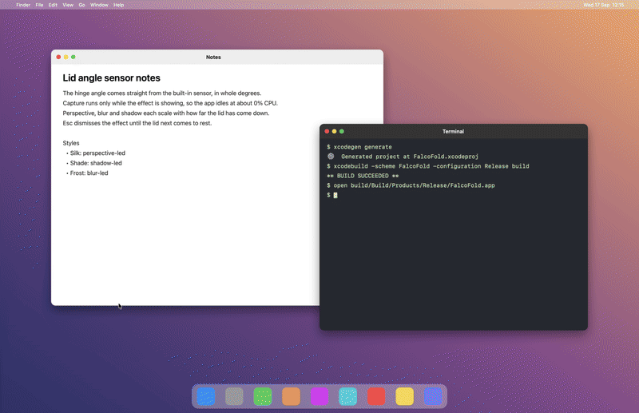

# FalcoFold

As you close your MacBook's lid, the desktop tilts, blurs and dims, following the hinge. Open it again and everything snaps back.

FalcoFold is a free, open-source macOS menu bar app inspired by [Bendy](https://trybendy.app). It is an independent project and is not affiliated with Bendy.



## Requirements

- An Apple silicon MacBook with a lid angle sensor. The Welcome window checks for it on first launch and tells you if it isn't there.
- macOS 14 Sonoma or later.

## Install

1. Download `FalcoFold-<version>.zip` from the [latest release](https://github.com/pietrouk/FalcoFold/releases/latest) and unzip it.
2. Move `FalcoFold.app` to your Applications folder.
3. Open it. The first launch needs one extra step, described next, because the app isn't notarized.

### Opening an app that isn't notarized

FalcoFold is signed ad hoc rather than with an Apple Developer ID, so Gatekeeper blocks the first launch.

- **macOS 15 and later:** open the app once and dismiss the warning. Then go to System Settings → Privacy & Security, scroll down to the Security section, and click **Open Anyway** next to the FalcoFold message. Confirm with your password or Touch ID.
- **macOS 14:** Control-click `FalcoFold.app` in the Finder, choose **Open**, then click **Open** in the dialog.

If macOS says the app is "damaged", clear the quarantine flag from Terminal and open it again:

```sh
xattr -d com.apple.quarantine /Applications/FalcoFold.app
```

### Permissions

- **Screen Recording.** FalcoFold draws a live copy of your desktop, so it needs this permission. The Welcome window asks for it on first launch. You can also grant it in System Settings → Privacy & Security → Screen & System Audio Recording, then relaunch the app. Frames are only shown on screen; nothing is saved or sent anywhere.
- **After each update** macOS asks for Screen Recording again. The permission is tied to the app's code signature, and an ad-hoc signature changes with every build.
- **Every so often** macOS shows a dialog saying FalcoFold is requesting to "bypass the system private window picker". That is the system's periodic check on apps that capture the whole screen. Click Allow; the effect keeps working in the meantime.
- The lid angle sensor needs no permission.

## Using it

FalcoFold lives in the menu bar. Click its icon to see the current lid angle, pick a style, pause, or open Settings.

- **Styles.** Silk leads with perspective, Shade with shadow and Frost with blur. The Perspective, Blur and Shadow sliders stay editable for every style. "Hold its place from where you sit" counter-rotates the picture so it stays visually steady as the lid moves.
- **Lid behaviour.** The effect follows the lid while it moves below the clear angle (100° by default; change it in Settings → Style). Once the lid holds still for a moment, the desktop snaps back so you can keep working at any angle. Moving the lid a few degrees brings the effect back, and opening past the clear angle clears it.
- **Esc** dismisses the effect until the lid next comes to rest. The key is only captured while the effect is showing, so Esc works normally otherwise.
- **Pause FalcoFold**, in the menu or in Settings, stops everything until you resume.
- **Set angle by hand**, in the menu, previews the effect with a slider without moving the lid.
- **Launch at login** is in Settings → General.
- FalcoFold plays no sound.

## Build from source

You need Xcode 15 or later and [XcodeGen](https://github.com/yonaskolb/XcodeGen) (`brew install xcodegen`).

In `project.yml`, set `DEVELOPMENT_TEAM` to your own team ID. A free Apple ID "Personal Team" works, and you can find its ID in Xcode → Settings → Accounts. A stable signature keeps the Screen Recording permission between builds while you develop.

```sh
xcodegen generate
xcodebuild -project FalcoFold.xcodeproj -scheme FalcoFold -configuration Debug -derivedDataPath build build
open build/Build/Products/Debug/FalcoFold.app
```

Or run `xcodegen generate`, open `FalcoFold.xcodeproj` in Xcode and press Run.

To produce a release zip like the ones on the Releases page (an ad-hoc-signed Release build, no Apple account needed), run:

```sh
scripts/make-release.sh
```

## How it works

- **Sensor.** `LidSensor` reads the built-in HID lid angle sensor (vendor `0x05AC`, product `0x8104`) in whole degrees. It polls at 60 Hz only while the lid is near or below the clear angle and at 10 Hz when the lid is wide open, and reopens the device after sleep.
- **Capture.** A ScreenCaptureKit stream of the built-in display runs only while the effect is showing. It excludes FalcoFold's own windows, so the overlay never captures itself. With the lid open the app sits at about 0% CPU.
- **Overlay.** A click-through Metal window covers the built-in display. Perspective, Gaussian blur and shading all scale with how far the lid has come down. Captured frames are fingerprinted on the GPU so the overlay only redraws when the desktop actually changed.
- **Edge cases.** With the lid closed on an external display (clamshell), or while the built-in display is asleep, the effect waits until the display is back. Denied or revoked Screen Recording shows a message instead of an effect.

## Privacy

FalcoFold makes no network connections: no telemetry, no update checks, no accounts. Screen frames are processed on your Mac and never leave it.

## Acknowledgements

- [Bendy](https://trybendy.app) for the idea.
- The [LidAngleSensor](https://github.com/samhenrigold/LidAngleSensor) project, whose write-up of the sensor's HID report format made the sensor code straightforward.

## License

[MIT](LICENSE)
